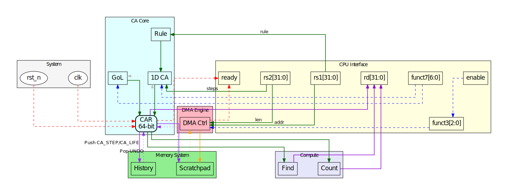

# NIMA-STEP: A RISC-V Coprocessor for Cellular Automata

[](LICENSE)
[]()
[]()

## Architecture Overview


**NIMA-STEP** is a custom RISC-V coprocessor that accelerates cellular automata computation through hardware-software co-design, achieving **100–500× speedup** over software baselines for rules like Rule 110 and Conway's Game of Life.

## Features

- **15 Custom Instructions** extending RISC-V `custom-0` opcode
- **64-bit Cellular Automaton Register (CAR)** with parallel evolution engines
- **Support for:**
  - 1D Elementary CA (all 256 Wolfram rules)
  - 2D Conway's Game of Life on 8×8 grids
  - Pattern matching and population counting
  - Undo/history (8-level deep circular buffer)
- **2 KiB Scratchpad** with DMA-like bulk transfer instructions
- **Verified RTL** with comprehensive Cocotb test suite (12/12 passing)
- **Up to 9.6 × 10⁹ cell updates/second** at 150 MHz

## Quick Start

### Prerequisites

- **Simulator:** Icarus Verilog 12.0+
- **Test Framework:** Cocotb 1.9.2+ and Python 3.7+
- **Compiler (optional):** RISC-V GCC toolchain

### Running Tests

```bash
cd tests
make cocotb
make results
